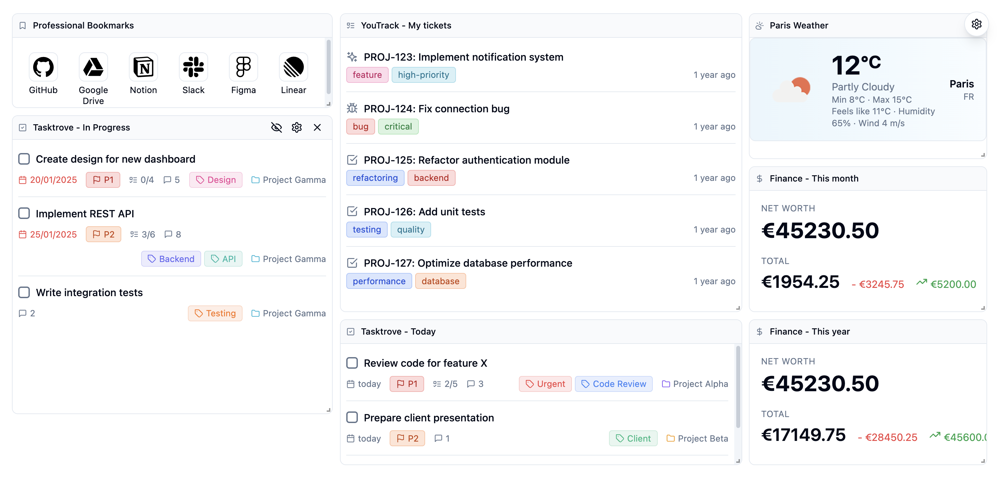
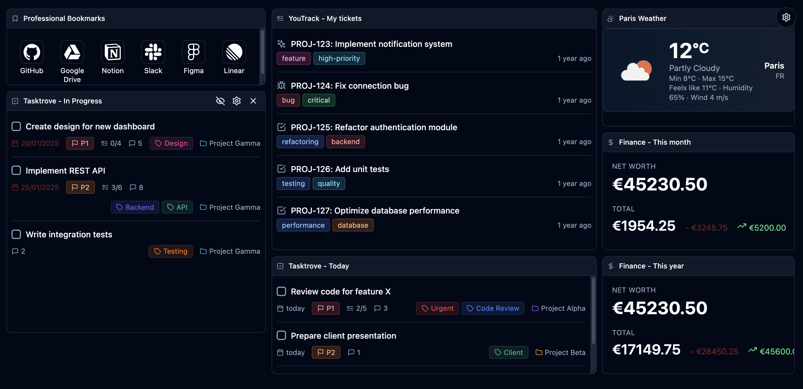
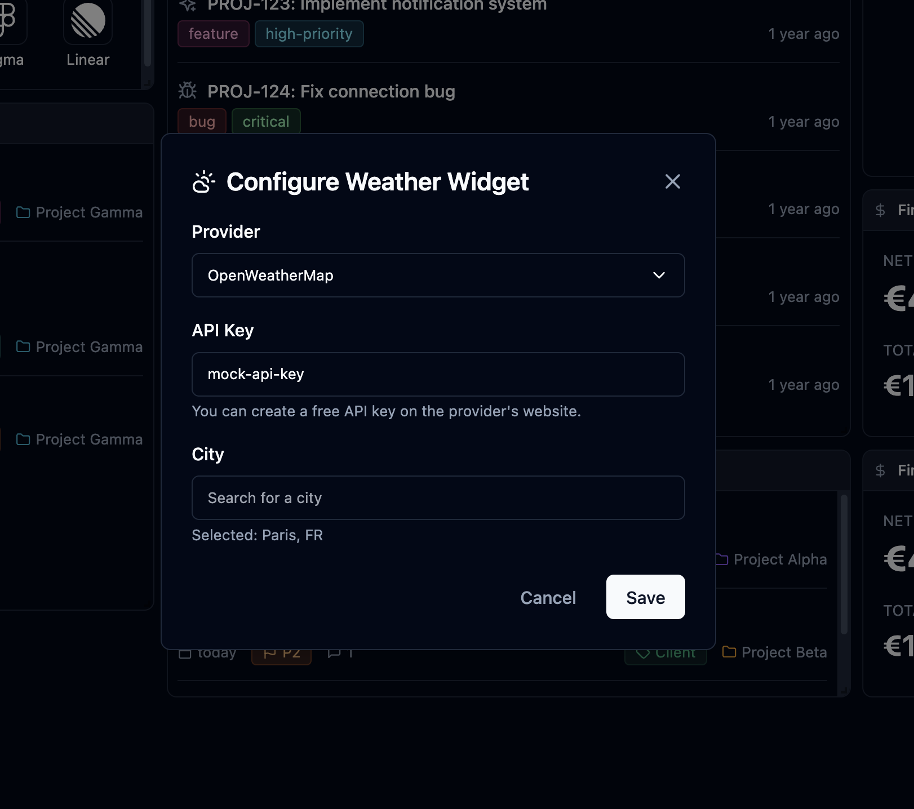

# Dashboard New Tab

A customizable, widget-based dashboard extension for Chrome and Firefox that replaces your browser's default new tab page with a powerful, flexible dashboard system.





## Overview

Dashboard New Tab is a browser extension that transforms your new tab page into a fully customizable dashboard. It features a drag-and-drop grid layout system where you can add, arrange, resize, and configure various widgets to create your perfect workspace.

## Features

### Core Functionality

- **Drag & Drop Layout**: Arrange widgets freely on a responsive grid layout
- **Resizable Widgets**: Customize the size of each widget to fit your needs
- **Dark Mode**: Toggle between light and dark themes with persistent storage
- **Export/Import**: Save and restore your entire dashboard configuration
- **Persistent Storage**: All your widgets, positions, and configurations are saved automatically
- **Responsive Design**: Adapts to different screen sizes with breakpoints

### Widget System

The extension uses a plugin-based architecture, making it easy to add new widget types. Each widget can be:
- **Named**: Give custom names to your widget frames
- **Configured**: Each widget has its own configuration modal
- **Edited**: Click the gear icon to enter edit mode and configure the widget
- **Deleted**: Remove widgets you no longer need

## Available Widgets

### 1. Bookmarks

A powerful bookmark manager with icon support.

**Features:**
- Add, edit, and delete bookmarks
- Custom icons from Simple Icons library (3000+ icons)
- Icon search with autocomplete
- Two-line title display for better readability
- Compact grid layout

**Configuration:**
- No configuration required - start adding bookmarks immediately

### 2. Youtrack

Display and manage issues from your [Youtrack](https://www.jetbrains.com/youtrack/) instance.

**Features:**
- View unresolved issues
- Issue type icons (bug, feature, task)
- Tag display with color coding
- Relative timestamps ("x days ago") with full date tooltips
- Clickable issue links that open in the same tab
- Auto-refresh every 5 minutes

**Configuration:**
- Base URL: Your Youtrack instance URL
- API Endpoint: The API endpoint URL
- Authorization Header: Your authentication token
- Issue Fields: Customizable field list (default provided)
- Query: Youtrack query string (default: "#Unresolved")

### 3. Tasktrove

Manage tasks from your [Tasktrove](https://github.com/dohsimpson/TaskTrove) instance.

**Features:**
- Task list with completion status
- Checkbox to toggle task completion
- Due date display with smart formatting (yesterday, today, tomorrow)
- Priority indicators (P1: red, P2: orange, P3: blue)
- Subtask progress tracking
- Comment count
- Tag and project display with colors
- Status filtering (Today, Upcoming, Completed)
- Project and label filtering
- Auto-refresh every 5 minutes

**Configuration:**
- API Endpoint: Your Tasktrove API endpoint
- API Token: Authentication token
- Status Filter: Filter by Today, Upcoming, or Completed
- Projects: Multi-select project filter
- Labels: Multi-select label filter

### 4. Weather (Meteo)

Display current weather and forecast information.

**Features:**
- Current weather with large icon
- Temperature display (current, min, max)
- Weather description
- Additional details (feels like, humidity, wind speed)
- Multi-day forecast (adapts to widget size)
- City and country display
- Auto-refresh every 10 minutes

**Configuration:**
- Provider: Currently supports [OpenWeatherMap](https://openweathermap.org/)
- API Key: Your OpenWeatherMap API key
- City: Search and select your city with autocomplete

**Note:** The forecast section automatically hides when the widget height is insufficient, and the number of forecast days adapts to the widget width.

### 5. Firefly

Display financial summary and net worth from [Firefly](https://github.com/firefly-iii/firefly-iii) III API.

**Features:**
- Net worth display
- Total spent and earned amounts
- Visual breakdown: spent (red with minus) and earned (green with arrow)
- Currency support (EUR, USD)
- Period selection (this month, this year, last month, last year)
- Auto-refresh every 5 minutes

**Configuration:**
- API Endpoint: Your Firefly III API endpoint
- API Token: Authentication token
- Currency: Select EUR or USD
- Period: Choose time period for the summary

## Installation

### For Development

1. Clone the repository:
```bash
git clone <repository-url>
cd browser-newtab-dashboard
```

2. Install dependencies:
```bash
npm install
```

3. Build the extension:
```bash
npm run build
```

4. Load the extension in your browser:
   - **Chrome/Edge**: Go to `chrome://extensions/`, enable "Developer mode", click "Load unpacked", and select the `dist` folder
   - **Firefox**: Go to `about:debugging`, click "This Firefox", click "Load Temporary Add-on", and select `dist/manifest.json`

### For Production

1. Build the extension:
```bash
npm run build
```

2. The `dist` folder contains the extension ready to be packaged:
   - **Chrome**: Use Chrome Web Store developer dashboard
   - **Firefox**: Use Firefox Add-on Developer Hub

## Usage

### Adding Widgets

1. Click the "+" button in the header (or the "Add Widget" button on an empty dashboard)
2. Select a widget type from the modal
3. The widget will appear on your dashboard

### Configuring Widgets

1. Click the gear icon on any widget frame
2. Enter edit mode and configure the widget settings
3. Click "Save" to apply changes



### Managing Widgets

- **Move**: Drag widgets by their header (drag handle)
- **Resize**: Use the resize handles on widget corners
- **Rename**: Click the gear icon and edit the widget name inline
- **Delete**: Click the "X" button that appears on hover

### Settings Menu

Click the gear icon in the header to access:
- **Add Widget**: Open the widget selector
- **Dark Mode**: Toggle between light and dark themes
- **Export Dashboard**: Download your dashboard configuration as JSON
- **Import Dashboard**: Restore a previously exported configuration

### Export/Import

- **Export**: Saves all widgets, their positions, sizes, names, and configurations
- **Import**: Restores a complete dashboard from a JSON file
- Useful for backing up your dashboard or sharing configurations

## Technical Details

### Architecture

The extension is built with:
- **React 18**: UI framework
- **TypeScript**: Type safety
- **Vite**: Build tool
- **Tailwind CSS**: Styling
- **react-grid-layout**: Drag-and-drop grid system
- **lucide-react**: Icon library

### Plugin System

The extension uses a plugin-based architecture:

```typescript
interface Plugin {
  metadata: PluginMetadata;
  DashboardView: React.ComponentType<PluginComponentProps>;
  EditView: React.ComponentType<PluginComponentProps>;
  IconComponent?: React.ComponentType<{ className?: string }>;
}
```

Each plugin provides:
- **DashboardView**: The main widget display component
- **EditView**: The configuration interface
- **IconComponent**: Optional React icon component
- **Metadata**: Plugin information (id, name, description, version)

### Storage

All data is stored using Chrome's storage API:
- Dashboard layout and widget configurations
- Theme preference (light/dark)
- Widget names and positions

### Build Process

The build process:
1. TypeScript compilation
2. Vite bundling
3. Manifest and icons copying to `dist` folder

### Browser Compatibility

- **Chrome/Chromium**: Full support (Manifest V3)
- **Firefox**: Full support (with `manifest.firefox.json` if needed)

## Development

### Project Structure

```
src/
├── components/          # React components
│   ├── DashboardContent.tsx
│   ├── Frame.tsx
│   ├── SettingsMenu.tsx
│   └── ...
├── plugins/            # Widget plugins
│   ├── bookmarks/
│   ├── youtrack/
│   ├── tasktrove/
│   ├── meteo/
│   └── finance/
├── lib/                # Utilities
│   ├── storage.ts
│   └── plugin-registry.ts
└── types/              # TypeScript types
```

### Adding a New Widget

1. Create a new folder in `src/plugins/`
2. Implement the plugin structure:
   - `types.ts`: TypeScript interfaces
   - `api.ts`: API functions (if needed)
   - `*DashboardView.tsx`: Main display component
   - `*EditView.tsx`: Configuration component
   - `*ConfigModal.tsx`: Configuration modal (if needed)
   - `*Plugin.tsx`: Plugin definition
3. Register the plugin in `src/lib/plugin-registry.ts`

### Scripts

- `npm run dev`: Start development server
- `npm run build`: Build for production
- `npm run build:chrome`: Build for Chrome
- `npm run build:firefox`: Build for Firefox
- `npm run lint`: Run ESLint

## Configuration

### Manifest

The extension uses Manifest V3 with:
- `chrome_url_overrides.newtab`: Overrides the new tab page
- `web_accessible_resources`: Allows access to bundled assets
- `host_permissions`: Required for API calls to external services

### Permissions

- `storage`: Save dashboard configurations
- `tabs`: Required for new tab override
- `http://*/*` and `https://*/*`: Access external APIs

## Troubleshooting

### Widgets Not Displaying

- Check browser console for errors
- Verify API credentials are correct
- Ensure network requests are not blocked

### Layout Issues

- Clear browser cache and reload
- Export your configuration before troubleshooting
- Check if widgets are too small (minimum size: 2x2 grid units)

### Build Errors

- Ensure all dependencies are installed: `npm install`
- Check TypeScript errors: `npm run build`
- Verify Node.js version compatibility

## Contributing

Contributions are welcome! Please:
1. Fork the repository
2. Create a feature branch
3. Make your changes
4. Test thoroughly
5. Submit a pull request

## License

This project is licensed under the MIT License.

## Version History

- **1.0.2**: Current version
  - Multiple widget types
  - Export/Import functionality
  - Dark mode support
  - Responsive grid layout

## Support

For issues, questions, or feature requests, please open an issue on the repository.

